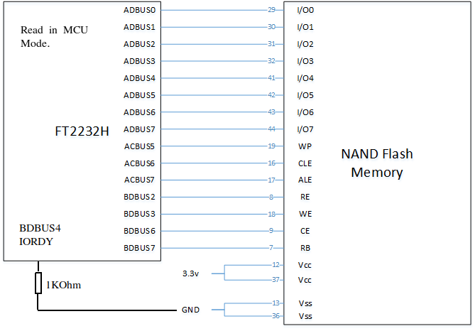

# DumpFlash
DumpFlash is a tool to retrieve and write Flash data to the physical NAND Flash memory or virtual image file. Various operations like ECC check and on-image pattern recognition, extraction and rewriting for u-Boot bootloader and JFFS2 file system are supported.

---
## Prerequisites

### libusb-1.0
http://zadig.akeo.ie/


### PyUSB

* pip install pyusb

### pyftdi
* Use one of the following options.
   * Install from source https://github.com/eblot/pyftdi
   * pip install pyftdi

Note (PtrO): uses (only) pyftdi-0.29.0 retrieved from tag https://github.com/eblot/pyftdi/tree/v0.29.0
   
---
## Install

```
pip install git+https://github.com/ohjeongwook/dumpflash
```
Note: for ptro use url: https://github.com/ptrooms/dumpflash/blob/ptro/

---
### Upgrade

```
pip install git+https://github.com/ohjeongwook/dumpflash --upgrade
```
Note: for ptro use url: https://github.com/ptrooms/dumpflash/blob/ptro/

---
### Changes

   By PtrO, March-April 2023:
   * specifically tested & adapted to Samsung NanD chip K9F1G08X0C 128MBytes, others shoudl work also.
   * Improved fault free reading by addressing per byte which unfortunately limit read speed to approx 1500 bytes/second.
   * adapted to python3 (specifcally array bytes vs string use)
   * added test function to generate & write data
   * verified working functionality: read, write, check-badblocks, erase
   * added file processing function to strip or (re)add) OOB from/to file
   * write/read by options, can do/remove/add the native OOB / JFFS processing & ecc check

---
### Key Usage

use: python3 dumpflash.py -h  for help.

Be careful as some options have other effects with commands.

### Hardware connection
* 

Display interface & chip status:
```
ptro@sh67:~/code-dumpflash/dumpflash$ python3 dumpflash.py
Type of FTDI= ft2232h , has_mpsse= True , wideport= True , bitbang= False
 write_data_get_chunksize= 4096 , read_data_get_chunksize= 4096
I/O access mode for ftdi Slow=False
Full ID:         ECF109541
ID Length:       4
Name:            NAND 128MiB 3,3V 8-bit
ID:             0xf1
Page size:       0x800(2048)
Transfer size:   512
OOB size:       0x40 (64)
Page count:     0x10000
Size:           0x80
Erase size:     0x20000
Block count:     1024
Options:         1
Address cycle:   4
Bits per Cell:   1
Manufacturer:    Samsung
```

Read specific page range per byte (preventing read errors) to file
```
python3 dumpflash.py -s 0 -t 1 -p 65216 65276 -c read -r -i
```

Rewrite input file to relocated page numbers, using oob (-Raw and not -r-addoob) as is
```
python3 dumpflash.py -s 0 -t 1 -R -p 65216 65276 -r -c write mtd1_oob.bin
```

Erase blocks to 0xff (without setting ecc/oob/jffs)
```
python3 dumpflash.py -b 1019 1020 -c erase -v
```

Create testdata streams to chip (-s type, -r-addoob, -j-ffs)
```
 python3 dumpflash.py -s 1 -p 65281 -1 -c testp -r
 python3 dumpflash.py -s 9 -p 65281 -1 -c testp
 python3 dumpflash.py -s 1 -p 65281 -1 -c testp -j

```

---
## Notes

* The software use the Fdti2232H highbyte address MCU (0x08) mode lines 
to control A15/CLE (command latch), A14/ALE (Address latch) and 
A13/Write-Protect status. 
* The lowbyte/datalines A0/D0-A7/D7 are conencted as usual.
* The WR/RD lines of MCU mode are conencte to WE en RE pins of the nandChip.
* The NanD R_B output is feed back to IO/0 (MCU mode input of Ftdi2232H)
* The IO/1 MCU mode output of the Fdti2232H is used to ChipSelect
* The IORDY pin 43 BDBUS4 needs to be pulled LOW/gnd to widen the read/write window.

The software uses the FTDI MCU mode functions to queuue bitbang and envelope
the NaND command/read/write functions.

---
## Documentations
For more details, please read following:

   * https://www.blackhat.com/docs/us-14/materials/us-14-Oh-Reverse-Engineering-Flash-Memory-For-Fun-And-Benefit-WP.pdf
   * https://www.blackhat.com/docs/us-14/materials/us-14-Oh-Reverse-Engineering-Flash-Memory-For-Fun-And-Benefit.pdf
   * http://recon.cx/2014/slides/Reverse%20Engineering%20Flash%20Memory%20for%20Fun%20And%20Benefit.pdf
   * Black Hat USA 2014 https://www.youtube.com/watch?v=E8BSnS4-Kpw
   * Recon 2014 https://www.youtube.com/watch?v=nTPfKT61730
   * Updated by O.Kleinecke in March/April 2015 to improve LP-NAND-Chip support.
   * Updated by Peter Ooms in March/April 2023 to improve error-free reading & make writing possible.

   * KNOWN ISSUES : TODO : Add (cleaner!?) OOB/ECC Support for LP-Devices.
   * TODO : Add create/read BBT functions

   * Solved by PtrO: Investigate FTDI/Code based malwritten/malread bytes (byte mismatch for read/write after chip erase every 256/256+1/256+2 bytes)
   * FTDI documents: 
   *    https://ftdichip.com/wp-content/uploads/2020/07/DS_FT2232H.pdf 
   *    http://www.ftdichip.com/Support/Documents/AppNotes/AN_108_Command_Processor_for_MPSSE_and_MCU_Host_Bus_Emulation_Modes.pdf
   * Samsung chip datasheet K9F1G08X0C

## LICENSE
Copyright (c) 2014, Jeong Wook Oh & (c) 2023 Peter Ooms
All rights reserved.

Redistribution and use in source and binary forms, with or without modification, are permitted provided that the following conditions are met:
   * Redistributions of source code must retain the above copyright notice, this list of conditions and the following disclaimer.
   * Redistributions in binary form must reproduce the above copyright notice, this list of conditions and the following disclaimer in the documentation and/or other materials provided with the distribution.
   * Neither the name of the names of its contributors may be used to endorse or promote products derived from this software without specific prior written permission.

THIS SOFTWARE IS PROVIDED BY THE COPYRIGHT HOLDERS AND CONTRIBUTORS "AS IS" AND ANY EXPRESS OR IMPLIED WARRANTIES, INCLUDING, BUT NOT LIMITED TO, THE IMPLIED WARRANTIES OF MERCHANTABILITY AND FITNESS FOR A PARTICULAR PURPOSE ARE DISCLAIMED. IN NO EVENT SHALL THE COPYRIGHT HOLDER OR CONTRIBUTORS BE LIABLE FOR ANY DIRECT, INDIRECT, INCIDENTAL, SPECIAL, EXEMPLARY, OR CONSEQUENTIAL DAMAGES (INCLUDING, BUT NOT LIMITED TO, PROCUREMENT OF SUBSTITUTE GOODS OR SERVICES; LOSS OF USE, DATA, OR PROFITS; OR BUSINESS INTERRUPTION) HOWEVER CAUSED AND ON ANY THEORY OF LIABILITY, WHETHER IN CONTRACT, STRICT LIABILITY, OR TORT (INCLUDING NEGLIGENCE OR OTHERWISE) ARISING IN ANY WAY OUT OF THE USE OF THIS SOFTWARE, EVEN IF ADVISED OF THE POSSIBILITY OF SUCH DAMAGE.

